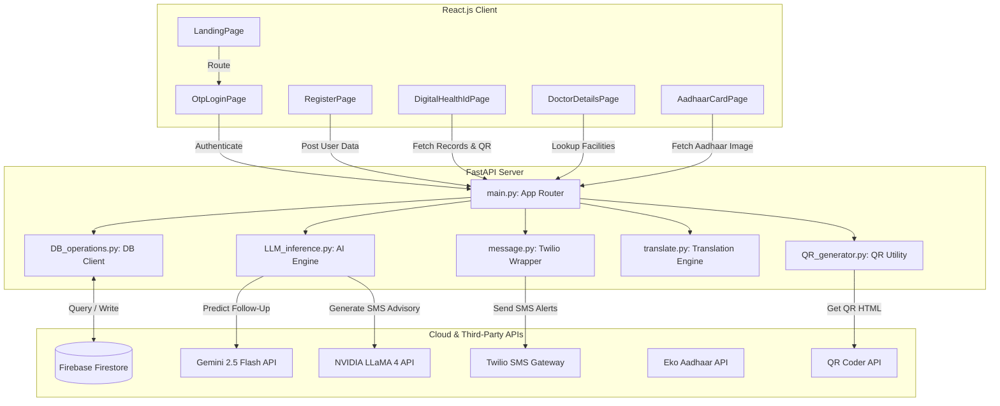

# 📘 ShramiKare - Complete Technical Documentation & Codebase Architecture

ShramiKare is a multilingual, digital health record and surveillance platform designed to cater to the health requirements of migrant workers in Kerala, aligned with SDG-3 (Good Health and Well-being). This document provides an in-depth breakdown of the codebase architecture, database schemas, API surfaces, AI-powered integrations, and setup instructions.

---

## 🏗️ Architectural Blueprint

The application employs a decoupled client-server architecture with React.js power on the frontend and FastAPI running the backend, integrating Google Firestore for a scalable, flexible, schema-less document database. 



---

## 🗄️ Database Schemas (Firestore)

ShramiKare utilizes Google Firebase Firestore for storing data. The two primary collections are `users`, `otps`, and `facility`.

### 1. `users` Collection
Each document in the `users` collection is keyed by a unique auto-generated Firestore ID or Aadhaar number, containing the worker's demographics, health records, and employment history.

| Field Name | Type | Description |
|:---|:---|:---|
| `name` | `string` | Worker's full name |
| `age` | `number` | Worker's age |
| `gender` | `string` | `M` / `F` / `O` |
| `blood_group` | `string` | e.g. "A+", "O-" |
| `language` | `string` | Preferred language code (e.g. `ml`, `hi`, `or`, `as`, `en`) |
| `address` | `string` | Local/Current residence address |
| `aadhaarNumber`| `string` | Unique 12-digit Aadhaar Number (`xxxx-xxxx-xxxx`) |
| `phonenumber` | `number` | Mobile phone number (prefixed with `+91` during SMS operations) |
| `originState` | `string` | Worker's home state |
| `originDistrict`| `string` | Worker's home district |
| `destinationDistrict` | `string` | Work district in Kerala (e.g., Ernakulam) |
| `profilePhotoUrl` | `string` | URL to worker's avatar image |
| `records` | `map` | Nested map for tracking health parameters: |
| ↳ `vaccination1`| `boolean`| Status of first dose vaccination |
| ↳ `vaccination2`| `boolean`| Status of second dose vaccination |
| ↳ `specialNotes`| `string` | Pre-existing medical conditions, allergies, or observations |
| ↳ `lastVisitReason` | `string` | Symptoms or cause for the most recent checkup |
| ↳ `lastVisitDate` | `string` | ISO format date of the last clinic visit (`YYYY-MM-DD`) |
| ↳ `visitLocation` | `string` | Hospital or clinic name |
| ↳ `currentSymptoms` | `array` | List of active symptoms (e.g. `["fever", "cough"]`) |
| ↳ `nextFollowUpDate`| `string` | Predicted date of follow-up checkup (`YYYY-MM-DD`) |
| ↳ `reminderStatus` | `string` | Timestamp indicating when the last follow-up SMS was dispatched |
| ↳ `outbreakFlag`| `boolean`| Status flag for anomaly outbreak tracking |
| `companies` | `array` | List of employers: |
| ↳ `name` | `string` | Construction company or employer name |
| ↳ `from` | `string` | Employment start date (`YYYY-MM-DD`) |
| ↳ `to` | `string` | Employment end date or `None` if currently working |
| ↳ `working` | `boolean`| Flag for active employment status |

### 2. `otps` Collection
Stores OTPs mapped against `user_id` (Aadhaar number) for verification.

| Field Name | Type | Description |
|:---|:---|:---|
| `otpHistory` | `array` | Array of OTP records |
| ↳ `otp` | `string` | 6-digit verification code |
| ↳ `createdAt` | `string` | ISO Timestamp of creation |
| ↳ `expiresAt` | `string` | ISO Timestamp of expiry (normally `createdAt + 10 minutes`) |
| ↳ `status` | `string` | OTP status: `active` or `used` |

### 3. `facility` Collection
Documents in the `facility` collection are keyed by Kerala District Names (e.g., `Ernakulam`).

| Field Name | Type | Description |
|:---|:---|:---|
| `districtName` | `string` | Name of the district |
| `lastUpdated` | `string` | ISO timestamp of the last database sync |
| `healthFacilities` | `array` | Array of healthcare facilities: |
| ↳ `facilityName`| `string` | Name of clinic/hospital |
| ↳ `facilityType`| `string` | Category (`Hospital`, `Primary Health Centre`, etc.) |
| ↳ `address` | `string` | Location details |
| ↳ `phoneNumbers`| `array` | Contact numbers list |
| ↳ `services` | `array` | Available departments (e.g. `["General Medicine", "OPD"]`) |
| ↳ `workingHours`| `string` | Operating schedule |
| ↳ `remarks` | `string` | Operational comments |

---

## ⚡ Backend Services & APIs

The backend is built with FastAPI. Below is the directory mapping of internal scripts and API endpoints:

### Python Modules
- [main.py](file:///c:/Users/KIIT/Desktop/SAION/CODING%20WORLD/GITHUB/SIH%202025/shramikare/backend/main.py): Registers app routing, CORS headers, error handlers, and invokes logic from secondary controllers.
- [DB_operations.py](file:///c:/Users/KIIT/Desktop/SAION/CODING%20WORLD/GITHUB/SIH%202025/shramikare/backend/DB_operations.py): Firestore database client operations (Create, Read, Update, Delete, OTP Storage, and OTP verification).
- [LLM_inference.py](file:///c:/Users/KIIT/Desktop/SAION/CODING%20WORLD/GITHUB/SIH%202025/shramikare/backend/LLM_inference.py): Connects to Google GenAI API (`gemini-2.5-flash`) for date forecasting and NVIDIA Integrate API (`meta/llama-4-scout-17b-16e-instruct`) for personalized medical advisories.
- [translate.py](file:///c:/Users/KIIT/Desktop/SAION/CODING%20WORLD/GITHUB/SIH%202025/shramikare/backend/translate.py): Translates text output asynchronously via `googletrans` interface.
- [message.py](file:///c:/Users/KIIT/Desktop/SAION/CODING%20WORLD/GITHUB/SIH%202025/shramikare/backend/message.py): Dispatches text alerts using the Twilio client SDK.
- [QR_generator.py](file:///c:/Users/KIIT/Desktop/SAION/CODING%20WORLD/GITHUB/SIH%202025/shramikare/backend/QR_generator.py): Interfaces with the `qrcoder.co.uk` API to dynamically produce `` elements containing patient checkup lookups.

### 🌐 Endpoints Registry

All routes are served under the `/api` root path:

| HTTP Method | Route | Description | Core Query / Body Parameters |
|:---:|:---|:---|:---|
| **POST** | `/users/` | Registers a new worker to the database | JSON body matching the Migrant model |
| **GET** | `/users/` | Retrieves summaries of all workers | None |
| **GET** | `/users/json/` | Fetches JSON collection containing all user data | None |
| **GET** | `/users/by-aadhaar/{aadhaar}` | Searches for user records by Aadhaar ID | None |
| **GET** | `/users/id/{id}` | Fetches raw worker profile by DB doc ID | None |
| **PUT** | `/users/id/{id}` | Modifies worker profile. If `lastVisitDate` shifts, prompts LLM for follow-up date adjustment | JSON containing modified profile |
| **DELETE**| `/users/id/{id}` | Deletes worker profile from Firestore | None |
| **GET** | `/facilities/` | Looks up medical centers by district | `district` (string query parameter) |
| **POST** | `/send-reminder/` | Generates diagnostic advice via NVIDIA LLM, translates it, and sends via Twilio | `aadhaar_id` (string query parameter) |
| **GET** | `/outbreak-prediction/` | Pulls health data from users, evaluates outbreak risk using Gemini, and drops Twilio alerts to officials if risk score > 50 | None |
| **POST** | `/otp/generate/` | Produces a 6-digit secure validation OTP code, triggers translation, and sends via Twilio | `user_id` (string Form parameter) |
| **POST** | `/otp/validate/` | Validates active OTP codes | `user_id`, `otp` (string Form parameters) |
| **GET** | `/generate-qr/` | Returns HTML `` tag encoding a payload URL | `text` (string query parameter) |
| **GET** | `/send-followup-reminders/`| Scans database for users whose next follow-up dates are within 3 days and dispatches alerts | None |

---

## 🎨 Frontend Architecture (React)

The client side resides in `frontend/ShramiKare` and uses a clean SPA route model built over Vite. 

### Core Components
* **Layout Layout (`Layout.jsx`)**: The global layout of the application. Renders the responsive green header containing navigation controls, logo integration with sample fallback images, mobile dropdown hamburger options, and a copyright footer.
* **Landing Page (`pages/LandingPage.jsx`)**: Displays ShramiKare overview, events, goals, key features, and entry point triggers.
* **OTP Login (`pages/OtpLoginPage.jsx`)**: Flow that manages registration states and logins. Stores `userId` in client-side storage (`localStorage`) upon confirmation of validation OTP messages.
* **Registration Page (`pages/RegisterPage.jsx`)**: A long form handling personal demographics, previous clinics, active symptom check-boxes, and employer histories. Supports file attachments for Aadhaar cards and profile avatars using browser preview object URLs.
* **Digital Health Card (`pages/DigitalHealthIdPage.jsx`)**: Displays the worker's name, age, Aadhaar verification badge, database symptoms, history logs, and renders the dynamic QR verification code snippet returned from backend. Includes mock hooks to print PDF files or share cards.
* **Aadhaar Viewer (`pages/AadhaarCardPage.jsx`)**: Serves as a profile check page verifying uploaded Aadhaar images. Automatically falls back to standard mock card preview `/sample_aadhar.png` if user image is missing.
* **Provider Registry (`pages/DoctorDetailsPage.jsx`)**: Filter dashboard querying `/facilities/` by Kerala district, outlining hospital schedules, departments, address fields, and contact information.

---

## 🤖 AI Workflows & Orchestrations

ShramiKare incorporates advanced AI functionalities using Gemini and NVIDIA APIs to provide intelligent health tracking:

### 1. Follow-Up Date Prediction
When updating patient clinic records in `DB_operations.py`:
1. The backend detects changes to `records.lastVisitDate`.
2. The user profile is passed to `predict_follow_up_date` in [LLM_inference.py](file:///c:/Users/KIIT/Desktop/SAION/CODING%20WORLD/GITHUB/SIH%202025/shramikare/backend/LLM_inference.py).
3. The LLM `gemini-2.5-flash` evaluates the symptoms list, vaccination logs, and visit reason to determine the next follow-up date.
4. The output is parsed into `YYYY-MM-DD` and updated back into the database automatically.

### 2. Outbreak Prevention & AI Surveillance
Under the `/outbreak-prediction/` endpoint:
1. Active medical symptoms and geographic locations of all registered workers are fetched from Firestore.
2. The data is aggregated into a case summary report.
3. The report is analyzed by `gemini-2.5-flash` using a system prompt that calculates a severity risk factor (0-100) and detects cluster outbreaks.
4. If the risk factor exceeds `50`, an emergency notification SMS warning is dispatched to public healthcare coordinators.

### 3. Multilingual Reminders
For reminders and OTP messages:
1. Personalized diagnostic messages are synthesized using the NVIDIA `llama-4-scout-17b-16e-instruct` LLM.
2. The message is translated into the user's preferred language using the `googletrans` API in [translate.py](file:///c:/Users/KIIT/Desktop/SAION/CODING%20WORLD/GITHUB/SIH%202025/shramikare/backend/translate.py).
3. The localized text is sent as an SMS via Twilio.

---

## 🔐 Identity & Verification Flows

1. **Aadhaar Consent Setup**:
   The verification system uses a mock endpoint linked to `https://staging.eko.in/ekoapi/external/getAdhaarConsent` (configured in [aadhar_consent.py](file:///c:/Users/KIIT/Desktop/SAION/CODING%20WORLD/GITHUB/SIH%202025/shramikare/backend/verification/aadhar_consent.py)). This allows validation of Aadhaar numbers prior to onboarding profiles into the database.
2. **Double-Factor OTP Logins**:
   Allows passwordless logging in on smartphones and feature phones. A 6-digit numeric key is generated on the server, stored in the `otps` history index, and sent to the worker's mobile number.

---

## 🚀 Setup & Launch Manual

### Prerequisites
* Python 3.10+ installed
* Node.js & npm installed
* Firebase service account key json placed in the `/backend` folder.

### 1. Environment Configuration (`backend/.env`)
Create a `.env` file in the `backend/` directory:
```bash
NVIDIA_API_KEY=your_nvidia_api_key_here
GEMINI_API_KEY=your_gemini_api_key_here
TWILIO_ACCOUNT_SID=your_twilio_sid
TWILIO_AUTH_TOKEN=your_twilio_auth_token
TWILIO_PHONE_NUMBER=your_twilio_sender_phone_number
QRCODER_API_KEY=your_qrcoder_api_key
PORT=8000
```

### 2. Seeding & Running Backend Server
```bash
# Navigate to backend folder
cd backend

# Install dependencies
pip install -r requirements.txt

# Seed the Firebase facility collection
python facility_update.py

# Launch FastAPI app
uvicorn main:app --reload --port 8000
```

### 3. Launching Frontend App
```bash
# Navigate to frontend React workspace
cd frontend/ShramiKare

# Install components
npm install

# Start development hot-reload server
npm run dev
```

---
> [!NOTE]
> Ensure that the backend and frontend configurations in [config.js](file:///c:/Users/KIIT/Desktop/SAION/CODING%20WORLD/GITHUB/SIH%202025/shramikare/frontend/ShramiKare/src/config.js) and [OtpLoginPage.jsx](file:///c:/Users/KIIT/Desktop/SAION/CODING%20WORLD/GITHUB/SIH%202025/shramikare/frontend/ShramiKare/src/pages/OtpLoginPage.jsx) are aligned with the same port address (default `8000`).
